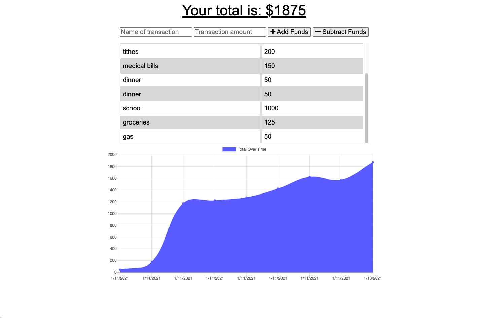

# budget-tracker

## Overview:

For this unit, we covered progressive web applications. Per MDN Web Docs, a progressive web app, or PWA, are web apps that use emerging web browser APIs and features along with traditional progressive enhancement strategy to bring a native app-like user experience to cross-platform web applications.

For this assignment, we were to add offline functionality to a pre-existing budget tracker application. With the enhanced app, the user can now add expenses and deposits via the budget app with or without an internet connection. When the user enters a transaction offline, the total amount of the transaction(s) can now be made available when the user is back online.

For more information regarding the aforementioned PWA, please see below. Thanks.

## Deployed Application Link

Please find the deployed webpage link here: https://guarded-crag-73571.herokuapp.com/

## Video of Application User Flow

## Screenshots of Generated Application

## Credits/Resources

1. Instructor Jonathan Watson provided a detailed demo of the budget tracker set up and functionality.

2. MongoDB Atlas: https://cloud.mongodb.com/

3. Heroku: https://dashboard.heroku.com/apps

4. IndexedDB API: https://developer.mozilla.org/en-US/docs/Web/API/IndexedDB_API

5. Progressive Web Apps: https://developer.mozilla.org/en-US/docs/Web/Progressive_web_apps

## MIT License

Copyright (c) [2021] [Bambo Adeshiyan]

Permission is hereby granted, free of charge, to any person obtaining a copy
of this software and associated documentation files (the "Software"), to deal
in the Software without restriction, including without limitation the rights
to use, copy, modify, merge, publish, distribute, sublicense, and/or sell
copies of the Software, and to permit persons to whom the Software is
furnished to do so, subject to the following conditions:

The above copyright notice and this permission notice shall be included in all
copies or substantial portions of the Software.

THE SOFTWARE IS PROVIDED "AS IS", WITHOUT WARRANTY OF ANY KIND, EXPRESS OR
IMPLIED, INCLUDING BUT NOT LIMITED TO THE WARRANTIES OF MERCHANTABILITY,
FITNESS FOR A PARTICULAR PURPOSE AND NONINFRINGEMENT. IN NO EVENT SHALL THE
AUTHORS OR COPYRIGHT HOLDERS BE LIABLE FOR ANY CLAIM, DAMAGES OR OTHER
LIABILITY, WHETHER IN AN ACTION OF CONTRACT, TORT OR OTHERWISE, ARISING FROM,
OUT OF OR IN CONNECTION WITH THE SOFTWARE OR THE USE OR OTHER DEALINGS IN THE
SOFTWARE.
